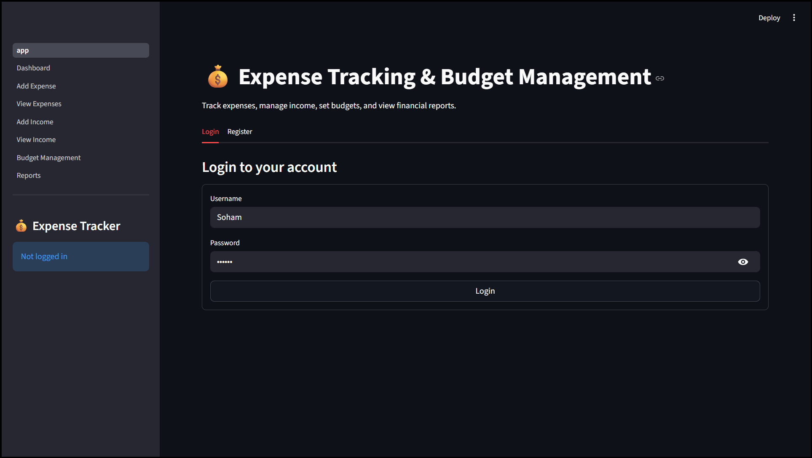
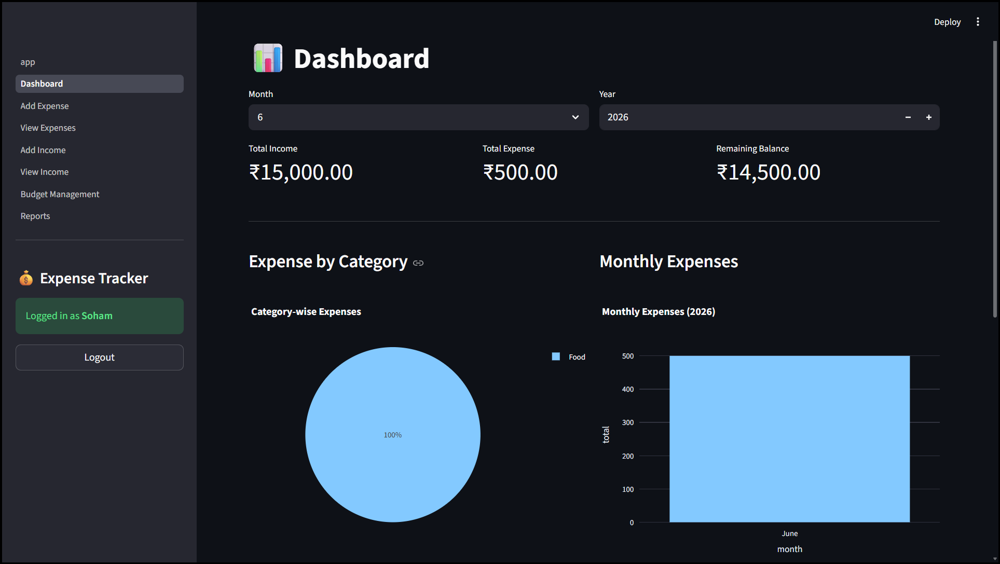
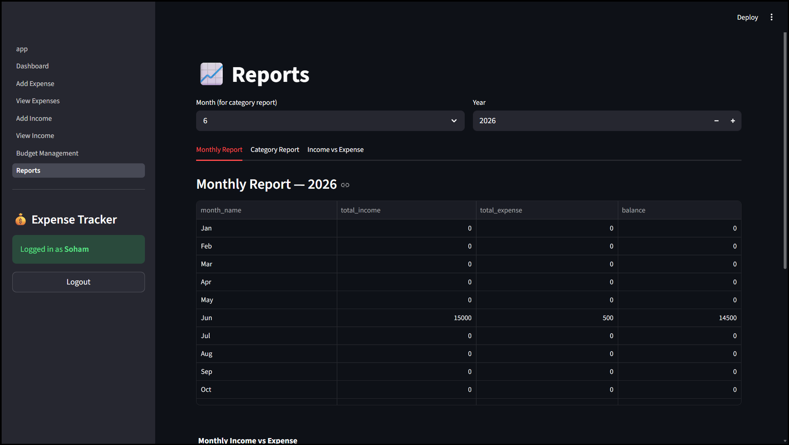
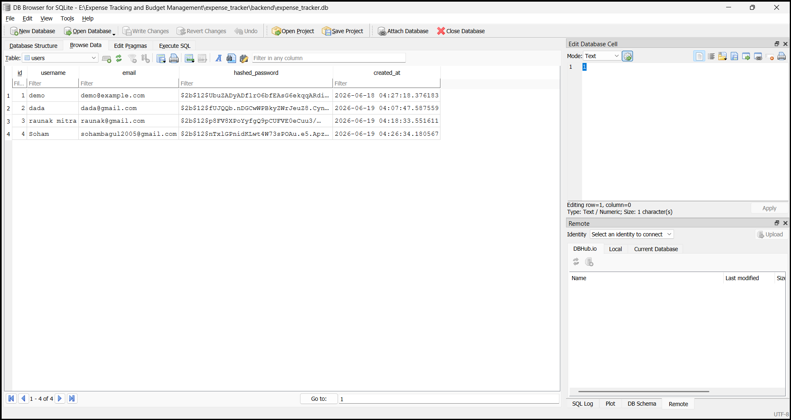

## Screenshots

### Login Page



### Dashboard



### Add Expense


### Reports



### Database



# Expense Tracking & Budget Management System

A full-stack college project for tracking expenses, managing income, setting budgets, and viewing financial reports.

**Backend:** FastAPI · SQLAlchemy · SQLite · JWT (Access + Refresh) · Pydantic V2  
**Frontend:** Streamlit · Plotly · Pandas

---

## Features

- User registration, login, JWT authentication, and logout
- CRUD for Expenses, Income, and Budgets
- Dashboard with summary metrics and charts
- Reports: monthly, category-wise, income vs expense
- User-specific data isolation (protected APIs)

---

## Project Structure

```
expense_tracker/
├── backend/
│   ├── app/
│   │   ├── main.py
│   │   ├── database.py
│   │   ├── models/
│   │   ├── schemas/
│   │   ├── routers/
│   │   ├── services/
│   │   ├── core/
│   │   ├── utils/
│   │   └── dependencies/
│   ├── requirements.txt
│   └── .env
├── frontend/
│   ├── app.py
│   ├── pages/
│   └── services/
└── README.md
```

---

## Prerequisites

- Python 3.12+
- pip

---

## Setup Instructions

### 1. Clone / open the project

```bash
cd expense_tracker
```

### 2. Backend setup

```bash
cd backend
python -m venv venv

# Windows
venv\Scripts\activate

# macOS / Linux
source venv/bin/activate

pip install -r requirements.txt
```

Create or edit `.env` (a default file is included):

```env
DATABASE_URL=sqlite:///./expense_tracker.db
SECRET_KEY=your-super-secret-key-change-in-production
ALGORITHM=HS256
ACCESS_TOKEN_EXPIRE_MINUTES=30
REFRESH_TOKEN_EXPIRE_DAYS=7
```

Start the FastAPI server:

```bash
uvicorn app.main:app --reload --host 127.0.0.1 --port 8000
```

API docs: [http://127.0.0.1:8000/docs](http://127.0.0.1:8000/docs)

### 3. Frontend setup

Open a **new terminal**:

```bash
cd frontend
pip install -r ../backend/requirements.txt
```

Start Streamlit:

```bash
streamlit run app.py
```

Frontend: [http://localhost:8501](http://localhost:8501)

---

## API Endpoints

### Auth
| Method | Endpoint | Description |
|--------|----------|-------------|
| POST | `/auth/register` | Register new user |
| POST | `/auth/login` | Login (returns access + refresh tokens) |
| POST | `/auth/refresh` | Refresh access token |
| POST | `/auth/logout` | Logout (client discards tokens) |

### Expenses
| Method | Endpoint | Description |
|--------|----------|-------------|
| POST | `/expenses` | Create expense |
| GET | `/expenses` | List expenses |
| GET | `/expenses/{id}` | Get expense |
| PUT | `/expenses/{id}` | Update expense |
| DELETE | `/expenses/{id}` | Delete expense |

### Income
| Method | Endpoint | Description |
|--------|----------|-------------|
| POST | `/income` | Create income |
| GET | `/income` | List income |
| PUT | `/income/{id}` | Update income |
| DELETE | `/income/{id}` | Delete income |

### Budget
| Method | Endpoint | Description |
|--------|----------|-------------|
| POST | `/budget` | Create budget |
| GET | `/budget` | List budgets |
| PUT | `/budget/{id}` | Update budget |
| DELETE | `/budget/{id}` | Delete budget |

### Dashboard
| Method | Endpoint | Description |
|--------|----------|-------------|
| GET | `/dashboard/summary` | Total income, expense, balance, budget usage |
| GET | `/dashboard/category-wise` | Category expense summary |
| GET | `/dashboard/monthly` | Monthly expense summary |

### Reports
| Method | Endpoint | Description |
|--------|----------|-------------|
| GET | `/reports/monthly` | Monthly report |
| GET | `/reports/category` | Category report |
| GET | `/reports/income-vs-expense` | Income vs expense report |

---

## Database Schema

```
User
├── Expenses (one-to-many)
├── Income   (one-to-many)
└── Budgets  (one-to-many)
```

SQLite database file: `backend/expense_tracker.db` (created automatically on first run).

---

## Usage Flow

1. Start the backend (`uvicorn`)
2. Start the frontend (`streamlit run app.py`)
3. Register a new account on the **Register** tab
4. Log in on the **Login** tab
5. Use sidebar pages: Dashboard, Add/View Expenses, Add/View Income, Budget, Reports

---

## Security Notes

- Passwords are hashed with bcrypt (passlib)
- JWT access tokens expire in 30 minutes (configurable)
- Refresh tokens expire in 7 days (configurable)
- All data endpoints require a valid Bearer token
- Users can only access their own data

---

## Tech Stack

| Layer | Technology |
|-------|------------|
| API | FastAPI |
| ORM | SQLAlchemy |
| Database | SQLite |
| Validation | Pydantic V2 |
| Auth | python-jose + passlib |
| UI | Streamlit |
| Charts | Plotly |

---

## License

MIT — free for educational use.
